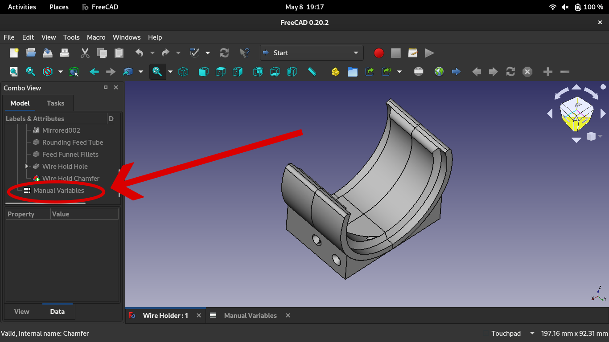

# WireHolder

This project uses FreeCAD 0.20.2 with the goal of making a spool holder that allows for the easy and convenient use of wire on a spool. Specifically, it is designed to prevent the wire from unspooling durring travel, while allowing the wire to be quickly and conveniently used when desired. Additionally, it allows for the spool to be easily removed when desired while firmly holding the spool. 

## Configuring the model to match a spool
As this project depends greatly on the dimentions of your spool of wire, I have created a spreadsheet to allow it to accomidate a variety of wire and spool sizes.

# 1. Download FreeCAD
In order to edit the file, you need to open the file in FreeCAD, an Open Source CAD Program, which you can download at [https://www.freecad.org/](https://www.freecad.org/). Once you have done this, simply open the "Wire Holder.FCStd" file with it.

# 2. Customize the File
In order to create a spool holder that fits your spool, it is important to enter the measured values from your spool into the spreadsheet entitled "Manual Variables", which can be found when you scroll down in the section depicted in the image below. 

When you click on it, you will be greeted with the following screen. When you are here, you simply need to take the measurements as they are described, and type those measurements in place of the numbers already there. Calipers are useful for this task.

# 3. Exporting your Model
One all of your measurements have been applied, click on the last feature in the tree labeled "Wire Hold Chamfer" so it is highlighted. Then, press space to display all of the features of the model. 

( * If you do not want one of the features in your file, go to the feature above it and press space there. * ) 

Then hold the shortcut **"ctrl+shift+E"**, and name the file. 

# 4. Print the File
This file should be ready for 3D Printing. I would suggest to print it by placing it on it's side while on the build plate rather than on it's base. I would reccomend having the non-centered wire hole near the top of the print. 

# Anticipated Issues:
Although it I have intended to make this model suited for customization, some values do break the model. 

If this happens, a box with red text is likely to pop up (which you can ignore), and some of the features will have yellow or red icons by them. Click the feature before the red and yellow icons start and press space. If this is suitable for your needs, you can export this instead.

Double check the model pictured matches what you expected. If it doesn't verify your values are correct. You may need to write down the values you entered and undo changes by repeatedly pressing **"ctrl+z"** until the warning icons disappear. If this doesn't work you may need to manually change the file.

If various curves are on the wrong edges, or if previous methods to fix the model didn't work, you may need to edit the file. To do this, go back to the top most warning or problematic curve and press space to show the model at that stage. Sometimes FreeCAD forgets which edges Chamfers are intended to be applied on after considerable changes to the file, so you will need to double click on the file and select the correct edges. To see what these edges are, either use the previous method of undoing to see how it was origionally layed out, or refer to another model. All you will need to do is click the remove button, and click on the incorrect edges, then place the add button and click on the desired edges. 

If this doesn't work, more dramatic edits may be required, which you are free to attempt.
